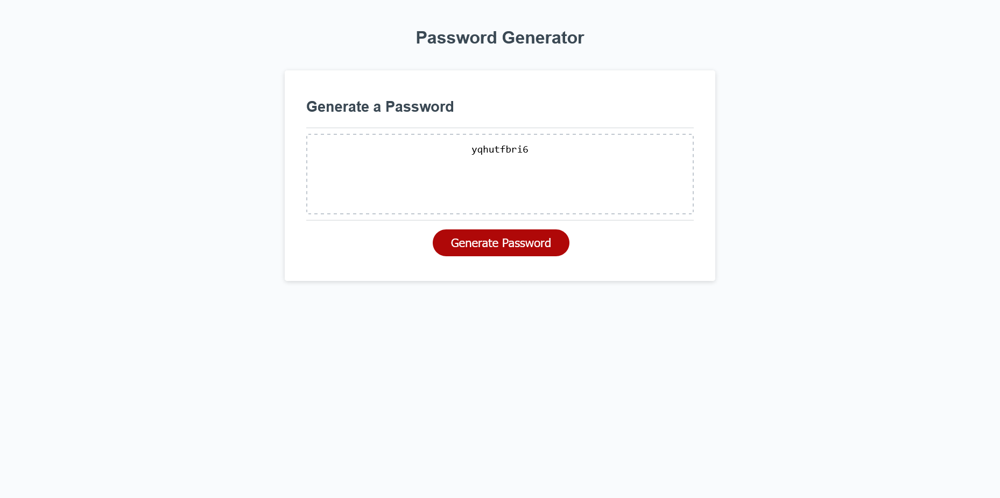

# Bootcamp Challenge Three

# Description

This website is a password generator with multiple selectable criteria, all done in JavaScript. When the 'Generate Password' button is hit, the user will be given multiple prompts asking for the desired length of the passwords and the character sets the want use. The four character sets are lowercase letters, uppercase letters, numeric characters, and special characters. These prompts are designed such that you must enter valid information, or will have to restart. After those prompts are finished, the generated password will appear in the text box.

This project taught me a lot, and I think was my favorite to complete to date. Not only was it the quickest, it also had multiple "AHA!" moments during coding that were incredibly satisfying. One of these "AHA!" moments was when I realized that I can construct the entire character list by concatenating the starting array onto an empty array. Another quite satisfying realization was figuring out that you can build the password by adding a result to itself each step of a for loop. An inconsequential but fun one was realizing that I didn't have to type out the uppercase character set, and could just use a for loop to capitalize the lowercase set.

# Website Link

The website can be found [here!](https://alecryanhunter.github.io/bootcamp-challenge-three/)

# Screenshot

